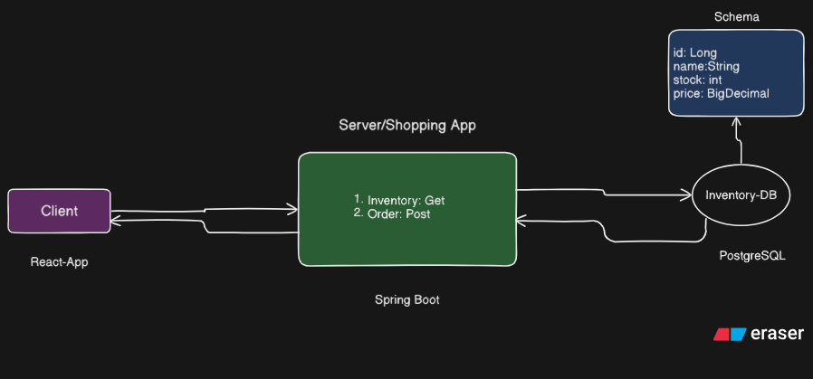

# Shopping Demo App – Design Overview

This document explains the high‑level design of the Shopping Demo backend, focusing on architecture and how concurrency is safely handled when multiple users try to buy the same item at the same time.

---

## 1. Architecture Diagram

### High‑Level Flow

### Component Responsibilities

* **Client**

    * Sends requests like:

        * `GET /inventory` → list items
        * `POST /buy` → buy item

* **Spring Boot Backend**

    * Controllers receive HTTP requests
    * Services contain business logic (buy item, check stock)
    * Repositories talk to database using JPA

* **PostgreSQL**

    * Stores inventory data
    * Enforces row‑level locking during critical updates

---

## 2. Concurrency Strategy

If two users click **"Buy"** at the exact same millisecond, both might read/write incorrect from inventory:

#### Strategy Used: Database Transaction + Row Locking (Pessimistic Lock)

* Lock the inventory row when someone is buying it.
* Only one transaction can modify that row at a time.

---

### When 2 Users Buys an Item at the same time

User A and User B click Buy at same millisecond

User A:
- Locks inventory row
- Checks stock
- Updates stock
- Commits

User B:
- Waits until User A finishes
- Then reads updated stock
- If stock is now 0 → throws "Out of Stock"
